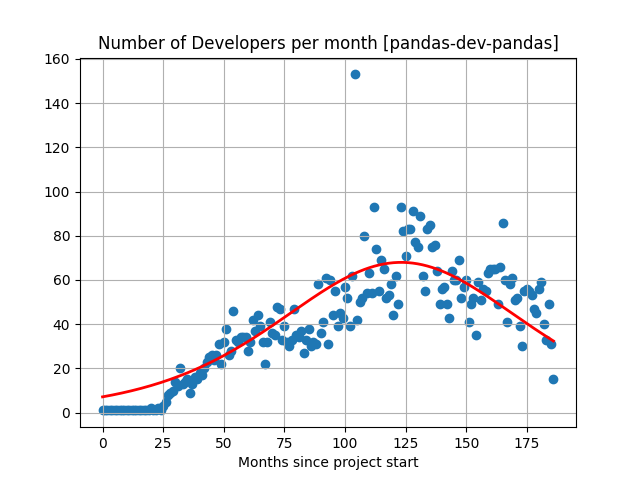
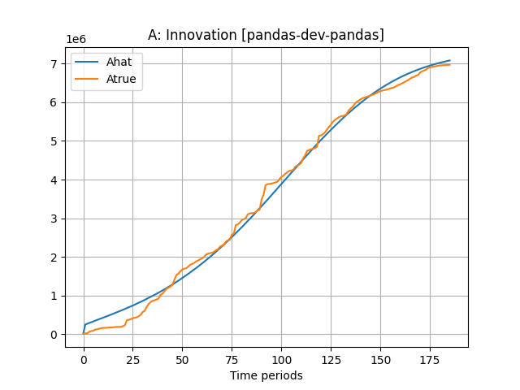
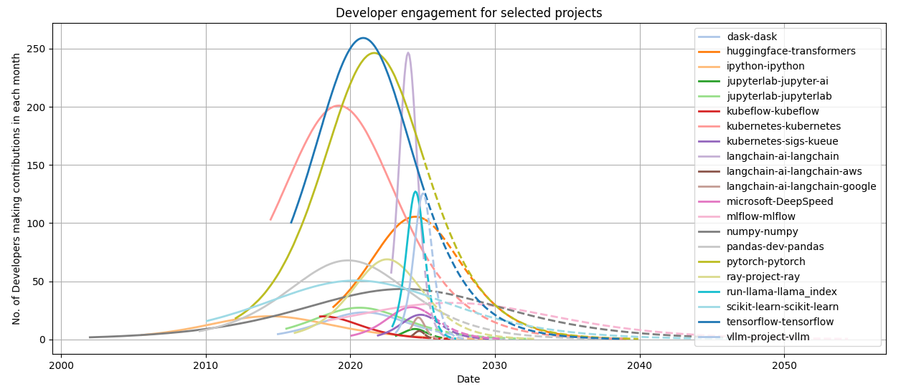

# Summary

Adapting models previously applied to product life cycles, this project models developer engagement through the project life cycle for open-source projects. The code enables users to gather and curate the required information from GitHub repositories and then fit an ordinary differential equation to commits data from GitHub in order to project lifetime developer engagement trajectories. In addition, endogenous growth theory is adapted to model growth dynamics in open-source software engineering, while incorporating the interactions between growth levels and developer activity over time using an additional differential equation for project growth. These solutions calibrate well to many open-source projects. The model generates an estimate of lifetime developer engagement and growth, which supports estimating a lifetime production value of open-source projects. These models may be used to drive open-source strategy and value open-source projects for tech firms. 

# Statement of need

This is a Python repository for analyzing open-source project dynamics of developer engagement and growth in the project. It enables analysis and forecasting of project life cycles in open source. 

The dynamical models in this project answer many questions relevant to formulating open-source strategy: (1) Can we understand developer engagement and is there are pattern across open-source projects? (Yes, the evidence shows the same S-curve as seen with product life cycles, see @bass_new_1969, @bass_why_1994). (2) How does developer engagement interact with project growth? (Some projects’ growth elasticity with developer engagement is positive and for others it is negative, leading to two different trajectories). (3) Is project growth endogenous and conforming to a version of Romer's growth model (@romer_increasing_1986, @romer_endogenous_1990, @romer_origins_1994)? (Yes). (4) Can we use the models for developer engagement and growth to project time to maturation of the project when it does not need additional resources than just a developer? (Yes). (5) Can life cycle information help in judging lifetime OS project value? (Yes, though it depends on valuation assumptions, see @horowitz_software_2001, @hoffmann_value_2024). (6) Is there a constant ratio of project success (downloads) to developer effort? (No, there is wide cross-sectional variation in project success relative to developer). These sorts of analyses implemented here may be used to assess how software projects are planned, staffed, and developed over their life cycles. 

# Mathematics

The two dynamical equations used for modeling are as follows:

[1] **Project growth**: The dynamics of project growth level $A$ are described by the following function of labor $L$ (contributors) and cumulative project growth $A$. This is known as the ``standing on the shoulders of giants'' effect (Isaac Newton, 1675), i.e., previous technological advancements drive new ones.     
$$
{\dot A} = \frac{dA}{dt} = \gamma L^{\lambda} A^{\phi} 
$$
Here, $\gamma>0$ is a constant "efficiency" parameter; $\lambda$ is elasticity of labor; if $\lambda=1$ doubling $L$ doubles the growth rate. If $\lambda<1$, there are diminishing returns to adding more contributors. If $\lambda>1$, there are increasing returns to adding contributors. Also, $\phi$ is growth spillover. If $\phi<0$, growth makes new growth harder (the "fishing out" effect). If $\phi=0$, new growth is not a function of past growth. If $0<\phi<1$, there are positive but diminishing returns to existing growth. If $\phi=1$, new growth is linear in existing growth. And if $\phi>0$, growth is explosive. There are scale effects: If $\lambda+\phi>1$, there are increasing returns to scale. If $\lambda+\phi=1$, there are constant returns to scale. If $\lambda+\phi<1$, there are decreasing returns to scale.

[2] **Developer engagement**: We adapt the @bass_new_1969 model to calibrate developer engagement. Define the probability of a developer working on an OS project in month $t$ as $f(t)$. Then, the probability of engagement at time $t$ is the density function $f(t)=F'(t)$, where $F(t)$ is the cumulative probability. We can re-express this as a rate, conditional on no engagement thus far, i.e., $\frac{f(t)}{1-F(t)}$. A functional form proposed for this rate is the diffusion equation
$$
\frac{dF/dt}{1-F} = p + q \cdot F, \quad F(0)=0
$$
where $p$ is the coefficient of independent engagement and $q$ is the coefficient of imitation (network effect). We can solve for $F(t)$: 
$$
F(t) = \frac{p[e^{(p+q)t}-1]}{p e^{(p+q)t}+q}
$$
Differentiating, we get the engagement probability density at time $t$:
$$
f(t) = \frac{dF}{dt} = \frac{e^{(p+q)t} p (p+q)^2}{[p e^{(p+q)t}+q]^2}
$$

[3] **Calibration**: Denoting the lifetime engagement as $m$, then expected engagement at time $t$ is $u(t)=m \cdot f(t)$. Using data, we want to estimate $\{p,q,m\}$. Cumulative engagement up to time $t$ is $U(t)=m \cdot F(t)$. The code calibrates these models to GitHub commits data. 

# Figures

We illustrate the calibration with two figures, one showing developer engagement (left) and the other showing growth in the project (right). The data is for the `pandas` project, a popular data analysis package in Python. 

{height="1.83in"}
{height="1.83in"}

We can extrapolate the solutions to the differential equations to map out the future trajectory of developer engagement, shown here for some popular projects. The dotted lines show the future path of the project after January 2025. 

{height="2.5in"}

# References
